# Nền tảng Tiếp nhận & Tự động hóa Dịch vụ CNTT Doanh nghiệp (IT Service Management Platform)

Giải pháp quản lý và tự động hóa quy trình hỗ trợ CNTT (ITSM) toàn diện cho doanh nghiệp, được xây dựng trên nền tảng **Microsoft Power Platform** (Power Apps, Power Automate, Power BI) kết hợp mô hình **Xử lý ngôn ngữ tự nhiên (Python NLP)** nhằm tối ưu hóa khả năng phân loại sự cố và giám sát cam kết chất lượng dịch vụ (SLA).

---

## 1. Tổng quan giải pháp

Hệ thống giải quyết bài toán tiếp nhận yêu cầu phân tán, thời gian xử lý thủ công kéo dài và thiếu công cụ đo lường cam kết dịch vụ (SLA) trong các tổ chức quy mô lớn:

* **Cổng tiếp nhận dịch vụ tập trung**: Ứng dụng **Microsoft Power Apps** 4 màn hình cho phép người dùng tự gửi yêu cầu, kiểm tra tính hợp lệ của dữ liệu theo thời gian thực và theo dõi tiến độ xử lý.
* **Động cơ tự động hóa quy trình**: Các luồng **Microsoft Power Automate** tự động định tuyến kỹ thuật theo ma trận phân quyền, kích hoạt quy trình phê duyệt cấp quản lý đối với sự cố khẩn cấp và quét cảnh báo vi phạm SLA định kỳ.
* **Báo cáo phân tích điều hành thời gian thực**: Bảng điều khiển **Microsoft Power BI** 3 trang chuẩn hóa theo mô hình Star Schema, cung cấp bức tranh toàn cảnh về MTTR (thời gian giải quyết trung bình), tỷ lệ tuân thủ SLA và khối lượng công việc của từng kỹ sư.
* **Mô hình AI phân loại sự cố**: Chương trình Python ứng dụng thuật toán TF-IDF và Multinomial Naive Bayes, đạt độ chính xác 94% trong việc tự động nhận diện loại yêu cầu và dự đoán mức độ ưu tiên từ mô tả của người dùng.

---

## 2. Kiến trúc hệ thống tổng thể

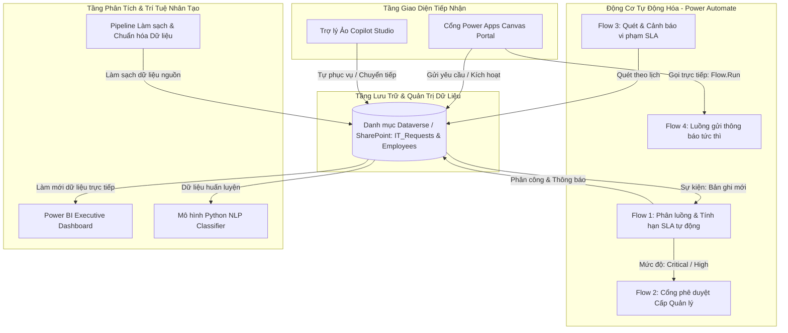

---

## 3. Ngăn xếp công nghệ sử dụng

| Lĩnh vực | Công nghệ | Phạm vi ứng dụng |
|---|---|---|
| **Giao diện người dùng** | Microsoft Power Apps | Ứng dụng Canvas 4 màn hình, kiểm tra tính hợp lệ dữ liệu động và liên kết ngữ cảnh người dùng |
| **Tự động hóa quy trình** | Microsoft Power Automate | Hệ thống luồng tự động (Automated) và tức thì (Instant) quản lý phân tuyến, phê duyệt và đếm hạn SLA |
| **Cơ sở dữ liệu** | Microsoft Dataverse / SharePoint Online | Cấu trúc dữ liệu quan hệ được chuẩn hóa theo từ điển dữ liệu nghiêm ngặt |
| **Phân tích dữ liệu & BI** | Microsoft Power BI & DAX | Mô hình Star Schema kết hợp bộ 13 công thức DAX đo lường các chỉ số điều hành cốt lõi |
| **Machine Learning / NLP** | Python (scikit-learn, pandas, NumPy) | Vector hóa văn bản TF-IDF và phân loại Naive Bayes tự động xác định loại sự cố và mức ưu tiên |
| **Kỹ thuật dữ liệu (ETL)** | Power Query (M Language) & Python | Pipeline tự động loại bỏ bản ghi trùng lặp, chuẩn hóa định dạng và xử lý giá trị trống |

---

## 4. Hình ảnh minh chứng hệ thống

### 4.1. Microsoft Power Apps — Giao diện Cổng Dịch vụ CNTT
| Trang chủ (Home Portal) | Form Gửi yêu cầu (Create Request) | Danh sách yêu cầu (My Requests) |
|:---:|:---:|:---:|
| 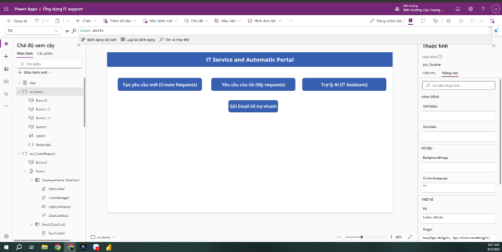 | 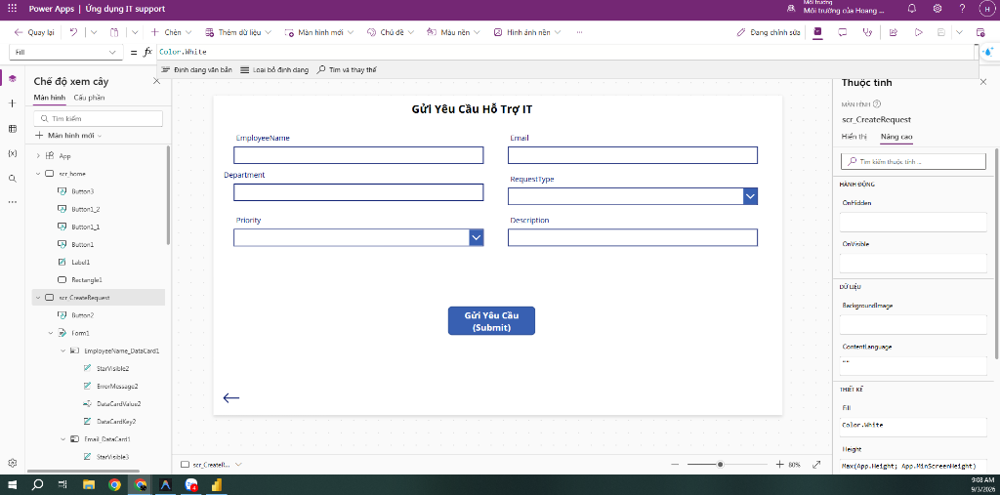 | 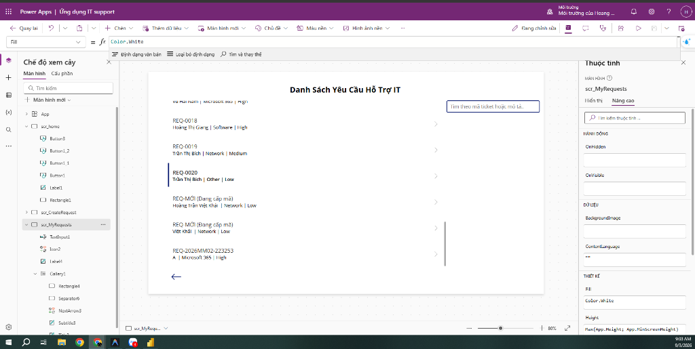 |

---

### 4.2. Microsoft Power BI — Bảng điều khiển Phân tích & Đo lường Hiệu suất
| Trang 1: Tổng quan điều hành (Executive KPI) | Trang 2: Phân tích & Kiểm soát SLA |
|:---:|:---:|
| 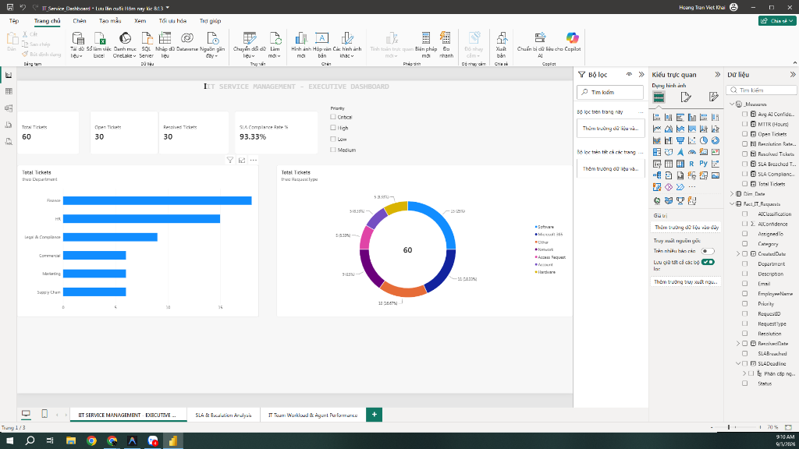 | 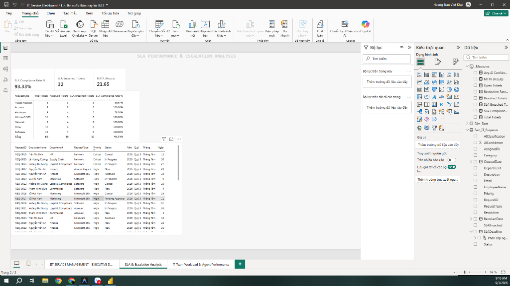 |

| Trang 3: Năng suất & Khối lượng công việc Kỹ sư |
|:---:|
| 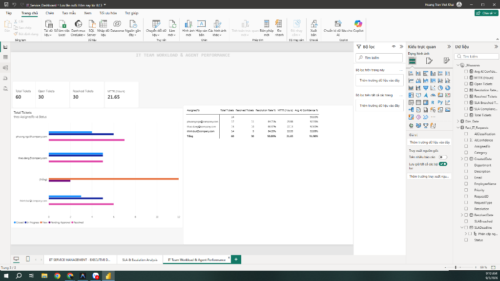 |

---

### 4.3. Microsoft Power Automate — Hệ thống Luồng Tự động hóa
| Danh mục các luồng (My Flows) | Luồng gửi thông báo tức thì (Instant Flow) |
|:---:|:---:|
| 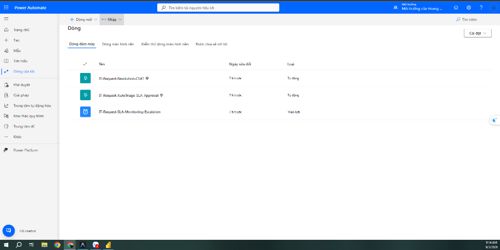 | 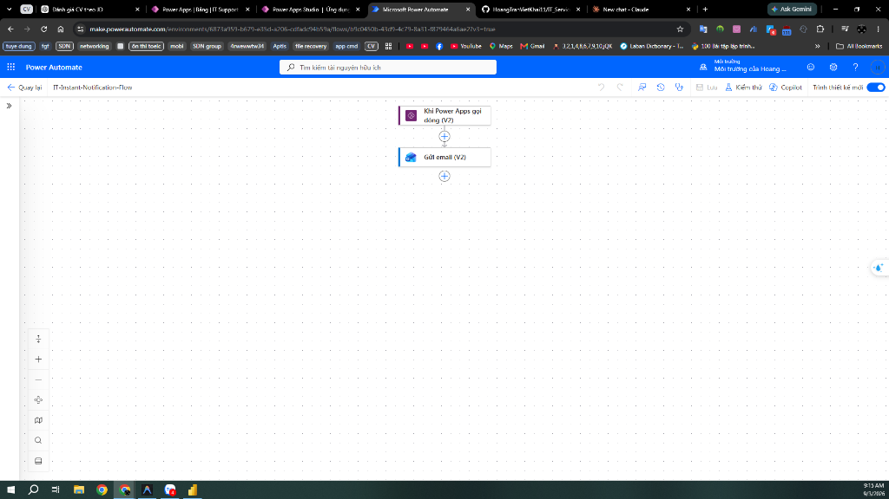 |

| Luồng phân tuyến & Tính hạn SLA | Luồng giám sát & Khảo sát CSAT |
|:---:|:---:|
| 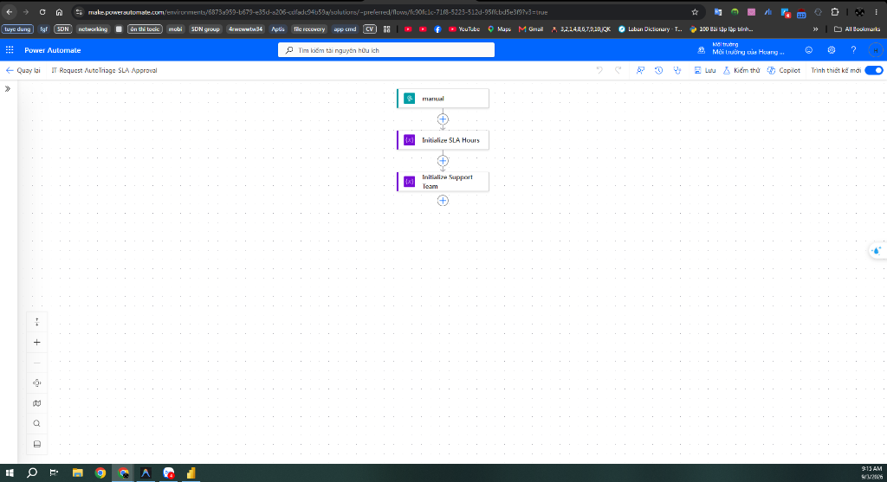 | 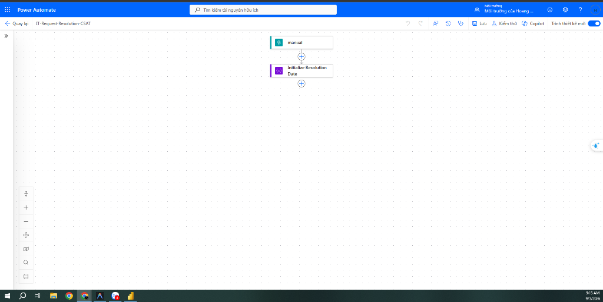 |

---

## 5. Cấu trúc thư mục dự án

```text
IT-Service-Automation/
│
├── README.md                                 # Tài liệu kỹ thuật tổng quan của dự án
│
├── docs/                                     # Bộ tài liệu đặc tả kỹ thuật doanh nghiệp
│   ├── Business_Requirements.md              # Tài liệu yêu cầu nghiệp vụ (BRD) & Ma trận SLA
│   ├── System_Architecture.md                # Thiết kế kiến trúc hệ thống và luồng dữ liệu
│   ├── Process_Flow.md                       # Đặc tả sơ đồ quy trình nghiệp vụ End-to-End
│   ├── Data_Dictionary.md                    # Từ điển dữ liệu, kiểu trường và mối quan hệ bảng
│   ├── Power_Automate_Flows.md               # Đặc tả kỹ thuật và biểu thức WDL của các Cloud Flows
│   ├── Power_BI_Dashboard_Spec.md            # Thiết kế Dashboard, mô hình Star Schema và DAX
│   ├── Copilot_Studio_Guide.md               # Kịch bản hội thoại Trợ lý ảo AI và cơ chế Escalation
│   ├── IT_Support_Knowledge_Base.md          # Cơ sở tri thức quy trình chuẩn và xử lý sự cố thường gặp
│   ├── UAT_Test_Plan.md                      # Kế hoạch kiểm thử người dùng (UAT) và ma trận nghiệm thu
│   └── User_Guide.md                         # Sổ tay hướng dẫn vận hành cho người dùng và kỹ sư IT
│
├── data/                                     # Dữ liệu mẫu và mã nguồn xử lý
│   ├── sample_employees.xlsx                 # Danh bạ nhân viên và ma trận quản lý mẫu
│   ├── sample_it_requests.xlsx               # Bộ dữ liệu chuẩn phục vụ Power BI (60 bản ghi)
│   ├── dirty_it_requests.xlsx                # Bộ dữ liệu thô chứa lỗi để kiểm thử quy trình ETL
│   ├── cleaned_it_requests.xlsx              # Dữ liệu đầu ra sau khi chạy pipeline làm sạch
│   ├── clean_data_pipeline.py                # Script Python tự động làm sạch và chuẩn hóa dữ liệu
│   ├── ai_ticket_classifier.py               # Mô hình Machine Learning phân loại sự cố bằng Python
│   ├── generate_datasets.py                  # Script Python sinh dữ liệu giả lập
│   ├── powerbi_dax_measures.dax              # Thư viện 13 công thức DAX đo lường chỉ số KPI
│   └── IT_Service_Dashboard.pbix             # File báo cáo gốc Power BI Desktop
│
└── screenshots/                              # Thư mục lưu trữ hình ảnh minh chứng hệ thống
    ├── powerapps/
    ├── powerautomate/
    └── powerbi/
```

---

## 6. Hướng dẫn cài đặt & Kiểm thử

### 6.1. Chạy thử nghiệm Mô hình AI Phân loại Sự cố (Python NLP)
```bash
# Chạy bộ kiểm thử tự động trên tập các kịch bản mẫu
python data/ai_ticket_classifier.py

# Khởi chạy chế độ dòng lệnh tương tác trực tiếp
python data/ai_ticket_classifier.py --interactive
```

### 6.2. Thực thi Pipeline Làm sạch & Chuẩn hóa Dữ liệu
```bash
python data/clean_data_pipeline.py
```

### 6.3. Triển khai Báo cáo Phân tích Power BI
* Mở file `data/IT_Service_Dashboard.pbix` bằng phần mềm **Power BI Desktop**.
* Nguồn dữ liệu được liên kết trực tiếp với file `data/sample_it_requests.xlsx`.
* Toàn bộ mã nguồn công thức DAX được lưu trữ tại `data/powerbi_dax_measures.dax`.
