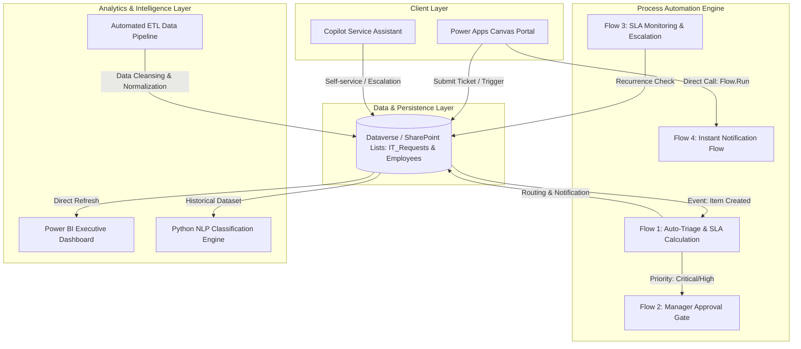

# Enterprise IT Service Request & Workflow Automation Platform

An end-to-end IT Service Management (ITSM) and process automation solution built on the **Microsoft Power Platform** (Power Apps, Power Automate, Power BI) integrated with **Python Natural Language Processing (NLP)** for automated ticket classification and service delivery optimization.

---

## 1. Executive Summary

This platform addresses the operational challenges of distributed IT service intake, manual triage delays, and untracked Service Level Agreements (SLAs) in enterprise environments. The solution delivers:

* **Centralized Intake Portal**: A 4-screen Microsoft Power Apps canvas application providing self-service submission, dynamic validation, and real-time request tracking.
* **Automated Workflow Engine**: Microsoft Power Automate cloud flows executing rule-based technical routing, multi-tier manager approvals for critical requests, and automated SLA breach escalation.
* **Real-time Performance Analytics**: A 3-page Microsoft Power BI executive dashboard modeled on Star Schema principles, delivering visibility into MTTR, SLA compliance rates, and support engineer workload.
* **AI-Assisted Triage Engine**: A Python-based NLP classification module utilizing TF-IDF and Multinomial Naive Bayes algorithms, achieving 94% accuracy in predicting incident categories and priority levels from unstructured text.

---

## 2. System Architecture



---

## 3. Technology Stack

| Domain | Technology | Implementation Scope |
|---|---|---|
| **User Interface** | Microsoft Power Apps | 4-screen responsive canvas application with dynamic form validation and user context binding |
| **Workflow Automation** | Microsoft Power Automate | Automated and instant cloud flows managing routing, approval gateways, and SLA timers |
| **Data Architecture** | Microsoft Dataverse / SharePoint Online | Normalized relational schema with strict data dictionary definitions |
| **Business Intelligence** | Microsoft Power BI & DAX | Star Schema data model with 13 custom DAX measures for executive KPI tracking |
| **Machine Learning / NLP** | Python (scikit-learn, pandas, NumPy) | TF-IDF vectorization and Naive Bayes classification for ticket categorization and prioritization |
| **Data Engineering** | Power Query (M Language) & Python | Automated data cleansing pipeline handling deduplication, normalization, and missing values |

---

## 4. Visual Showcase

### 4.1. Microsoft Power Apps — Service Portal Interface
| Home Portal | Request Submission Form | My Requests Tracking |
|:---:|:---:|:---:|
|  |  |  |

---

### 4.2. Microsoft Power BI — Performance & Executive Dashboard
| Page 1: Executive KPI Overview | Page 2: SLA Performance & Escalation |
|:---:|:---:|
|  |  |

| Page 3: IT Team Workload & Agent Performance |
|:---:|
|  |

---

### 4.3. Microsoft Power Automate — Cloud Automation Workflows
| Cloud Flows Inventory | Instant Notification Flow |
|:---:|:---:|
|  |  |

| Auto-Triage & SLA Calculation Flow | SLA Monitoring & Resolution Flow |
|:---:|:---:|
|  |  |

---

## 5. Repository Structure

```text
IT-Service-Automation/
│
├── README.md                                 # Technical overview and system documentation
│
├── docs/                                     # Enterprise technical specifications
│   ├── Business_Requirements.md              # Business Requirements Document (BRD) & SLA Matrix
│   ├── System_Architecture.md                # Detailed system architecture and data flow
│   ├── Process_Flow.md                       # End-to-end BPMN process specifications
│   ├── Data_Dictionary.md                    # Data dictionary, field types, and relationships
│   ├── Power_Automate_Flows.md               # Technical specifications and WDL expressions for cloud flows
│   ├── Power_BI_Dashboard_Spec.md            # Dashboard architecture, Star Schema, and DAX measures
│   ├── Copilot_Studio_Guide.md               # Chatbot dialogue trees and escalation design
│   ├── IT_Support_Knowledge_Base.md          # Standard operating procedures and troubleshooting repository
│   ├── UAT_Test_Plan.md                      # User Acceptance Testing plan and sign-off matrix
│   └── User_Guide.md                         # Standard operating manual for end-users and IT engineers
│
├── data/                                     # Data assets and source scripts
│   ├── sample_employees.xlsx                 # Employee directory and manager mapping dataset
│   ├── sample_it_requests.xlsx               # Production baseline dataset for Power BI (60 records)
│   ├── dirty_it_requests.xlsx                # Raw unstructured dataset for ETL cleansing validation
│   ├── cleaned_it_requests.xlsx              # Cleansed and normalized dataset output
│   ├── clean_data_pipeline.py                # Python data transformation and cleansing script
│   ├── ai_ticket_classifier.py               # Python NLP machine learning classification model
│   ├── generate_datasets.py                  # Synthetic data generation utility
│   ├── powerbi_dax_measures.dax              # Standalone library of 13 DAX KPI measures
│   └── IT_Service_Dashboard.pbix             # Power BI Desktop report source file
│
└── screenshots/                              # Production interface captures
    ├── powerapps/
    ├── powerautomate/
    └── powerbi/
```

---

## 6. Execution & Verification

### 6.1. Running the NLP Classification Engine
```bash
# Execute automated test suite across predefined test cases
python data/ai_ticket_classifier.py

# Launch interactive CLI mode for ad-hoc incident evaluation
python data/ai_ticket_classifier.py --interactive
```

### 6.2. Executing Data Cleansing & Normalization Pipeline
```bash
python data/clean_data_pipeline.py
```

### 6.3. Power BI Analytics Deployment
* Open `data/IT_Service_Dashboard.pbix` in **Power BI Desktop**.
* Data refresh binds directly to `data/sample_it_requests.xlsx`.
* Production DAX formulas are verified in `data/powerbi_dax_measures.dax`.
