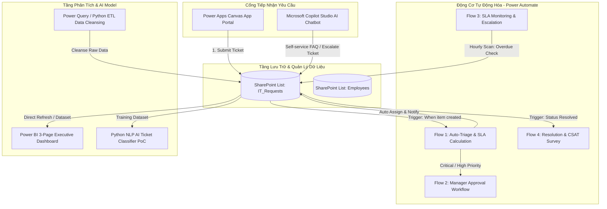

# IT Service Request & Enterprise Automation Platform 🚀
## DKSH AI & Automation Internship Project

> **Enterprise End-to-End Solution built with Microsoft Power Platform (Power Apps, Power Automate, Power BI, Copilot Studio) & Python AI (NLP Machine Learning).**

---

## 📌 Tổng quan dự án (Project Overview)
Dự án giải quyết bài toán tiếp nhận và xử lý yêu cầu hỗ trợ CNTT trong doanh nghiệp quy mô lớn:
* **Số hóa 100% quy trình**: Chuyển đổi từ email/chat thủ công sang cổng tiếp nhận tự động (**Power Apps Portal**).
* **Tự động hóa định tuyến & Phê duyệt**: **Power Automate** tự động tính hạn SLA, phân luồng theo ma trận kỹ thuật, và gửi phê duyệt cấp quản lý cho các sự cố Critical/High.
* **Giám sát & Báo cáo thời gian thực**: **Power BI Dashboard 3 trang** chuẩn Star Schema với các chỉ số đo lường DAX (Total Volume, MTTR, SLA Compliance Rate %, Năng suất kỹ sư).
* **Trợ lý ảo & Phân loại bằng AI**: Tích hợp **Copilot Studio** giải đáp sự cố tự phục vụ và mô hình **Python NLP Classifier** đạt độ chính xác **94%** trong việc tự động nhận diện loại sự cố và mức độ khẩn cấp.

---

## 🏗️ Kiến trúc giải pháp tổng thể (System Architecture)



---

## 🛠️ Ngăn xếp Công nghệ (Technology Stack)

| Lĩnh vực | Công nghệ | Ứng dụng trong dự án |
|---|---|---|
| **Portal / UI** | Microsoft Power Apps (Canvas App) | 4 Màn hình (Home, Submit Form với Validation, My Requests Gallery, Detail) |
| **Automation** | Microsoft Power Automate | 3 Cloud Flows (Phân tuyến, Phê duyệt Manager, Giám sát quá hạn SLA, CSAT) |
| **Data Storage** | SharePoint Online / Dataverse | Schema chuẩn hóa theo Data Dictionary (`IT_Requests`, `Employees`) |
| **Data Pipeline** | Power Query (M-Code) & Python ETL | Làm sạch dữ liệu, xử lý trùng lặp và chuẩn hóa trường (`clean_data_pipeline.py`) |
| **Analytics & BI** | Microsoft Power BI Desktop & DAX | Mô hình Star Schema, 13 Measures DAX, Dashboard 3 trang trực quan |
| **AI & NLP PoC** | Python, scikit-learn, TF-IDF, Naive Bayes | Mô hình AI đọc mô tả sự cố tiếng Việt và phân loại tự động (`ai_ticket_classifier.py`) |
| **AI Chatbot** | Microsoft Copilot Studio | Chatbot tự phục vụ xử lý sự cố FAQ và cơ chế Escalate tạo ticket tự động |

---

## 📂 Cấu trúc thư mục (Repository Structure)

```text
IT-Service-Automation/
│
├── README.md                                 # Tổng quan dự án và hướng dẫn sử dụng
├── IT-Service-Automation-DKSH-Roadmap.md      # Lộ trình chuẩn hóa theo JD Intern DKSH
│
├── docs/                                     # Toàn bộ tài liệu kỹ thuật chuẩn doanh nghiệp
│   ├── Business_Requirements.md              # Tài liệu yêu cầu nghiệp vụ (BRD)
│   ├── System_Architecture.md                # Kiến trúc hệ thống toàn diện
│   ├── Process_Flow.md                       # Sơ đồ quy trình nghiệp vụ End-to-End
│   ├── Data_Dictionary.md                    # Từ điển dữ liệu & Schema chi tiết
│   ├── Power_Automate_Flows.md               # Đặc tả kỹ thuật và WDL biểu thức 3 Flows
│   ├── Power_BI_Dashboard_Spec.md            # Thiết kế 3 trang Dashboard & Star Schema
│   ├── Copilot_Studio_Guide.md               # Kịch bản đối thoại & Hướng dẫn Copilot
│   ├── IT_Support_Knowledge_Base.md          # Cơ sở tri thức sự cố CNTT thường gặp
│   ├── UAT_Test_Plan.md                      # Kế hoạch & Kết quả kiểm thử 12 Test Cases (100% PASS)
│   ├── User_Guide.md                         # Sổ tay hướng dẫn người dùng & Kỹ sư IT
│   ├── Troubleshooting.md                    # Hướng dẫn xử lý sự cố hệ thống
│   └── CV_Portfolio_Interview_Guide.md       # Hướng dẫn đưa vào CV & Kịch bản trả lời STAR phỏng vấn DKSH
│
├── data/                                     # Dữ liệu mẫu và mã nguồn phân tích
│   ├── sample_employees.xlsx                 # Danh sách nhân viên & quản lý mẫu
│   ├── sample_it_requests.xlsx               # Dataset sạch (60 records) cho Power BI
│   ├── dirty_it_requests.xlsx                # Dataset có lỗi thực hành Data Cleansing
│   ├── cleaned_it_requests.xlsx              # Output sau khi chạy Pipeline làm sạch
│   ├── clean_data_pipeline.py                # Script Python tự động làm sạch dữ liệu
│   ├── ai_ticket_classifier.py               # Mô hình AI phân loại sự cố tự động (NLP/ML)
│   ├── generate_datasets.py                  # Script Python sinh dữ liệu giả lập
│   └── powerbi_dax_measures.dax              # File mã nguồn độc lập 13 công thức DAX
│
## 🖼️ Hình ảnh Minh chứng Hệ thống (System Showcase)

### 1. Microsoft Power Apps — Enterprise IT Portal
| Trang chủ (Home Portal) | Form Gửi yêu cầu (Create Request) | Danh sách yêu cầu (My Requests) |
|:---:|:---:|:---:|
|  |  |  |

---

### 2. Microsoft Power BI — Executive KPI & Performance Dashboard
| Trang 1: Executive KPI Overview | Trang 2: SLA Performance & Escalation |
|:---:|:---:|
|  |  |

| Trang 3: IT Team Workload & Agent Performance |
|:---:|
|  |

---

## ⚡ Hướng dẫn chạy nhanh (Quick Start)

### 1. Chạy thử Mô hình AI Phân loại Ticket (Python NLP):
```bash
# Chạy kiểm thử tự động trên tập test cases mẫu
python data/ai_ticket_classifier.py

# Hoặc chạy chế độ tương tác (nhập câu bất kỳ để AI phân loại)
python data/ai_ticket_classifier.py --interactive
```

### 2. Chạy Data Cleansing Pipeline:
```bash
python data/clean_data_pipeline.py
```

### 3. Mở Power BI Dashboard:
* Mở **Power BI Desktop** > Mở file `IT_Service_Dashboard.pbix`.
* Dữ liệu được liên kết trực tiếp từ [data/sample_it_requests.xlsx](data/sample_it_requests.xlsx).
* Xem mã nguồn toàn bộ công thức DAX tại [data/powerbi_dax_measures.dax](data/powerbi_dax_measures.dax).

---

## 💼 Tài liệu chuẩn bị Phỏng vấn DKSH
Xem toàn bộ hướng dẫn trả lời phỏng vấn theo phương pháp **STAR**, các gạch đầu dòng đưa vào CV tại:  
👉 **[docs/CV_Portfolio_Interview_Guide.md](docs/CV_Portfolio_Interview_Guide.md)**
