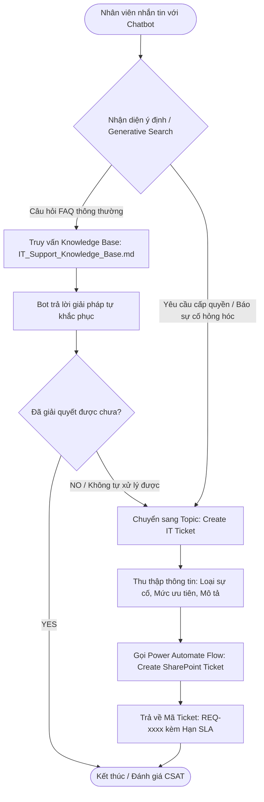

# Microsoft Copilot Studio Implementation Guide
## Project: IT Service Request & Automation Platform (DKSH Project)

Tài liệu hướng dẫn cấu hình chi tiết từng bước xây dựng Trợ lý ảo AI **IT Support Assistant** bằng **Microsoft Copilot Studio** và tích hợp tự động hóa qua **Power Automate**.

---

## 1. Kiến trúc luồng hội thoại (Chatbot Architecture)

---

## 2. Các bước cấu hình trong Microsoft Copilot Studio

### Bước 1: Khởi tạo Copilot mới
1. Truy cập [copilotstudio.microsoft.com](https://copilotstudio.microsoft.com).
2. Đăng nhập bằng tài khoản Microsoft trường/công ty.
3. Bấm **`+ Create`** (Tạo mới) > chọn **`New agent`** (hoặc **`New copilot`**).
4. Điền thông tin:
   * **Name**: `IT Support Assistant`
   * **Description**: `Trợ lý AI hỗ trợ tự phục vụ sự cố IT và tiếp nhận yêu cầu hỗ trợ cho nhân viên.`
   * **Language**: `Vietnamese (Tiếng Việt)` hoặc `English`.
5. Bấm **`Create`**.

---

### Bước 2: Nạp Cơ sở tri thức (Knowledge Base / Generative Answers)
1. Trong menu bên trái của Copilot Studio, bấm vào mục **`Knowledge`** (Tri thức).
2. Bấm **`+ Add knowledge`** (Thêm tri thức):
   * Chọn **Files**: Tải file [docs/IT_Support_Knowledge_Base.md](file:///d:/khai/AI_automation/docs/IT_Support_Knowledge_Base.md) (hoặc copy nội dung vào Document).
   * Hoặc chọn **Public Websites** / **SharePoint**: Trỏ đến trang SharePoint tài liệu nội bộ.
3. Bật tính năng **Generative Answers** để AI tự động trích xuất câu trả lời thông minh dựa trên tài liệu khi người dùng đặt câu hỏi tự do.

---

### Bước 3: Tạo Topic chính: `Create IT Request` (Tự động tạo Ticket khi cần hỗ trợ)

#### 1. Trigger Phrases (Các cụm từ kích hoạt):
* `Tôi muốn tạo ticket`
* `Báo hỏng máy tính`
* `Xin cấp quyền tài khoản`
* `Không tự sửa được cần IT hỗ trợ`
* `Tạo yêu cầu IT mới`

#### 2. Kịch bản hội thoại (Dialogue Flow Nodes):
1. **Question 1**:
   * *Nội dung hỏi*: "Bạn vui lòng chọn loại yêu cầu hỗ trợ:"
   * *Identify*: Multiple choice options (`Hardware`, `Software`, `Network`, `Account`, `Microsoft 365`, `Access Request`, `Other`)
   * *Save variable as*: `varRequestType`
2. **Question 2**:
   * *Nội dung hỏi*: "Mức độ ưu tiên của yêu cầu này là gì?"
   * *Identify*: Multiple choice options (`Low`, `Medium`, `High`, `Critical`)
   * *Save variable as*: `varPriority`
3. **Question 3**:
   * *Nội dung hỏi*: "Vui lòng mô tả ngắn gọn chi tiết sự cố bạn đang gặp phải:"
   * *Identify*: User's entire response
   * *Save variable as*: `varDescription`
4. **Action (Gọi Power Automate)**:
   * Bấm **`Add node (+)`** > chọn **`Call an action`** > chọn **`Create a flow`**.
   * Flow nhận 3 biến (`varRequestType`, `varPriority`, `varDescription`, `UserEmail`) $\rightarrow$ tạo bản ghi trong SharePoint List `IT_Requests` $\rightarrow$ trả về `TicketID` và `SLADeadline`.
5. **Message trả lời hoàn tất**:
   * "Cảm ơn bạn! Yêu cầu hỗ trợ IT của bạn đã được ghi nhận thành công với mã **Ticket #{TicketID}**."
   * "Cam kết thời gian xử lý (SLA) dự kiến: **{SLADeadline}**. Kỹ sư IT sẽ liên hệ hỗ trợ bạn sớm nhất!"
