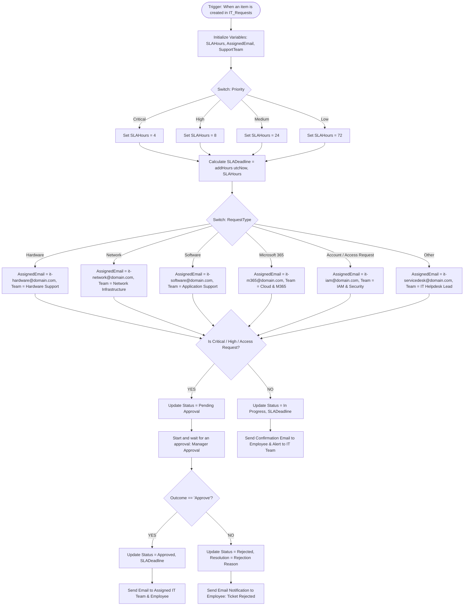
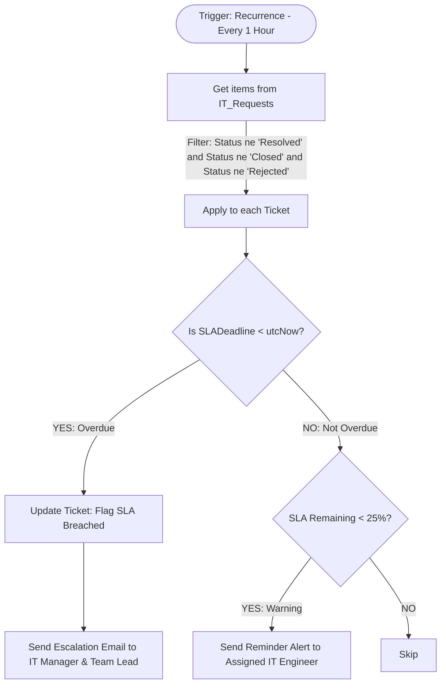
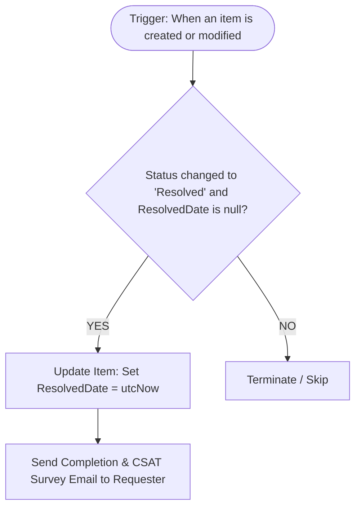

# Power Automate Flows Specification & Implementation
## Project: IT Service Request & Automation Platform (DKSH Project)

Tài liệu này cung cấp toàn bộ thiết kế kỹ thuật, cấu hình từng bước (step-by-step), các biểu thức WDL (Workflow Definition Language) và mã nguồn JSON cho 3 luồng tự động hoá Power Automate cốt lõi của hệ thống.

---

## 1. Danh sách các Flows

| STT | Tên Flow | Loại Flow | Trigger | Mục đích |
|---|---|---|---|---|
| **Flow 1** | `IT-Request-AutoTriage-SLA-Approval` | Automated Cloud Flow | When an item is created (SharePoint) | Tiếp nhận ticket, tính hạn SLA, gửi duyệt (nếu Critical/High), phân tuyến IT phụ trách và gửi email thông báo |
| **Flow 2** | `IT-Request-SLA-Monitoring-Escalation` | Scheduled Cloud Flow | Recurrence (Mỗi 1 giờ) | Quét các ticket chưa hoàn thành, cảnh báo sắp trễ hạn (<25% thời gian) và báo động khi quá hạn (SLA Breached) |
| **Flow 3** | `IT-Request-Resolution-CSAT` | Automated Cloud Flow | When an item is modified (SharePoint) | Ghi nhận thời gian hoàn thành (ResolvedDate), gửi email thông báo và khảo sát độ hài lòng (CSAT) |

---

## 2. Flow 1: IT-Request-AutoTriage-SLA-Approval

### 2.1. Sơ đồ xử lý (Workflow Diagram)



---

### 2.2. Chi tiết cấu hình các Actions (Step-by-Step)

#### **Trigger: When an item is created**
* **Site Address**: `https://<your-tenant>.sharepoint.com/sites/ITServicePortal`
* **List Name**: `IT_Requests`

#### **Action 1: Initialize Variables**
1. `varSLAHours` (Type: `Integer`, Value: `24`)
2. `varAssignedEmail` (Type: `String`, Value: `''`)
3. `varSupportTeam` (Type: `String`, Value: `''`)
4. `varSLADeadline` (Type: `String`, Value: `''`)

#### **Action 2: Switch on `Priority`**
* **On**: `@triggerOutputs()?['body/Priority/Value']`
  * **Case "Critical"**: Set `varSLAHours` = `4`
  * **Case "High"**: Set `varSLAHours` = `8`
  * **Case "Medium"**: Set `varSLAHours` = `24`
  * **Case "Low"**: Set `varSLAHours` = `72`

#### **Action 3: Calculate SLA Deadline**
* **Action**: `Set variable` (`varSLADeadline`)
* **Expression**:
  ```text
  addHours(triggerOutputs()?['body/Created'], variables('varSLAHours'))
  ```

#### **Action 4: Switch on `RequestType` (Routing Matrix)**
* **On**: `@triggerOutputs()?['body/RequestType/Value']`
  * **Case "Hardware"**: Set `varAssignedEmail` = `it-hardware@domain.com`, `varSupportTeam` = `Hardware & Equipment Support`
  * **Case "Network"**: Set `varAssignedEmail` = `it-network@domain.com`, `varSupportTeam` = `Network & Infrastructure Team`
  * **Case "Software"**: Set `varAssignedEmail` = `it-software@domain.com`, `varSupportTeam` = `Business Application Support`
  * **Case "Microsoft 365"**: Set `varAssignedEmail` = `it-m365@domain.com`, `varSupportTeam` = `M365 & Cloud Platform Team`
  * **Case "Account"** hoặc **"Access Request"**: Set `varAssignedEmail` = `it-iam@domain.com`, `varSupportTeam` = `Identity & Access Management (IAM)`
  * **Default ("Other")**: Set `varAssignedEmail` = `it-servicedesk@domain.com`, `varSupportTeam` = `IT Service Desk Lead`

#### **Action 5: Condition Kiểm tra Phê duyệt (Approval Gate)**
* **Expression**:
  ```text
  @or(
    equals(triggerOutputs()?['body/Priority/Value'], 'Critical'),
    equals(triggerOutputs()?['body/Priority/Value'], 'High'),
    equals(triggerOutputs()?['body/RequestType/Value'], 'Access Request')
  )
  ```

##### 👉 Nhánh YES (Cần Phê duyệt):
1. **Update item**: Đổi `Status` = `Pending Approval`, cập nhật `SLADeadline` = `variables('varSLADeadline')`.
2. **Start and wait for an approval**:
   * **Approval Type**: `Approve/Reject - First to respond`
   * **Title**: `[Phê duyệt yêu cầu IT] Ticket #@{triggerOutputs()?['body/ID']} - @{triggerOutputs()?['body/RequestType/Value']} (@{triggerOutputs()?['body/Priority/Value']})`
   * **Assigned To**: `@triggerOutputs()?['body/Author/Email']` *(hoặc Manager Email lấy qua Office 365 Users)*
   * **Details**:
     ```markdown
     ### Chi tiết yêu cầu IT:
     - **Mã Ticket**: #@{triggerOutputs()?['body/ID']}
     - **Người yêu cầu**: @{triggerOutputs()?['body/EmployeeName']} (@{triggerOutputs()?['body/Email']})
     - **Phòng ban**: @{triggerOutputs()?['body/Department/Value']}
     - **Loại yêu cầu**: @{triggerOutputs()?['body/RequestType/Value']}
     - **Mức ưu tiên**: @{triggerOutputs()?['body/Priority/Value']}
     - **Mô tả**: @{triggerOutputs()?['body/Description']}
     - **Hạn xử lý dự kiến (SLA)**: @{formatDateTime(variables('varSLADeadline'), 'dd/MM/yyyy HH:mm')}
     ```
3. **Condition: `Outcome` is equal to `Approve`**:
   * **Nếu Approve**:
     * **Update item**: `Status` = `Approved`, `AssignedTo` = `variables('varAssignedEmail')`.
     * **Send an email (V2)** gửi IT Team: Thông báo ticket đã duyệt, bắt đầu xử lý.
     * **Send an email (V2)** gửi Nhân viên: Thông báo yêu cầu đã được cấp quản lý phê duyệt.
   * **Nếu Reject**:
     * **Update item**: `Status` = `Rejected`, `Resolution` = `concat('Từ chối phê duyệt: ', outputs('Start_and_wait_for_an_approval')?['body/responseSummary'])`.
     * **Send an email (V2)** gửi Nhân viên: Thông báo từ chối kèm lý do.

##### 👉 Nhánh NO (Tự động chuyển tiếp - Auto Route):
1. **Update item**:
   * `Status` = `In Progress`
   * `SLADeadline` = `variables('varSLADeadline')`
   * `AssignedTo` = `variables('varAssignedEmail')`
2. **Send an email (V2) - Gửi Nhân viên**:
   * **To**: `@triggerOutputs()?['body/Email']`
   * **Subject**: `[IT Service Portal] Xác nhận tiếp nhận Ticket #@{triggerOutputs()?['body/ID']}`
   * **Body**:
     ```html
     <div style="font-family: Arial, sans-serif; padding: 15px; border-left: 4px solid #0078d4;">
       <h3>Xin chào @{triggerOutputs()?['body/EmployeeName']},</h3>
       <p>Yêu cầu hỗ trợ IT của bạn đã được tiếp nhận thành công vào hệ thống.</p>
       <table style="border-collapse: collapse; width: 100%; max-width: 500px;">
         <tr><td style="padding: 6px; font-weight: bold;">Mã Ticket:</td><td>#@{triggerOutputs()?['body/ID']}</td></tr>
         <tr><td style="padding: 6px; font-weight: bold;">Loại yêu cầu:</td><td>@{triggerOutputs()?['body/RequestType/Value']}</td></tr>
         <tr><td style="padding: 6px; font-weight: bold;">Mức ưu tiên:</td><td>@{triggerOutputs()?['body/Priority/Value']}</td></tr>
         <tr><td style="padding: 6px; font-weight: bold;">Bộ phận phụ trách:</td><td>@{variables('varSupportTeam')}</td></tr>
         <tr><td style="padding: 6px; font-weight: bold;">Cam kết SLA hoàn thành trước:</td><td style="color: #d83b01; font-weight: bold;">@{formatDateTime(variables('varSLADeadline'), 'dd/MM/yyyy HH:mm')}</td></tr>
       </table>
       <p>Bạn có thể theo dõi tiến độ xử lý trực tiếp trên ứng dụng <b>IT Service Portal</b>.</p>
     </div>
     ```
3. **Send an email (V2) - Gửi Kỹ sư IT phụ trách**:
   * **To**: `variables('varAssignedEmail')`
   * **Subject**: `[Phân công Ticket mới] #@{triggerOutputs()?['body/ID']} - @{triggerOutputs()?['body/RequestType/Value']} (@{triggerOutputs()?['body/Priority/Value']})`
   * **Body**: Nội dung chi tiết ticket kèm link mở trực tiếp ticket trên SharePoint/Power Apps.

---

## 3. Flow 2: IT-Request-SLA-Monitoring-Escalation

### 3.1. Sơ đồ xử lý (Workflow Diagram)



### 3.2. Cấu hình chi tiết

#### **Trigger: Recurrence**
* **Interval**: `1`
* **Frequency**: `Hour`

#### **Action 1: Get items**
* **Site Address**: `https://<your-tenant>.sharepoint.com/sites/ITServicePortal`
* **List Name**: `IT_Requests`
* **Filter Query**:
  ```text
  Status/Value ne 'Resolved' and Status/Value ne 'Closed' and Status/Value ne 'Rejected' and SLADeadline ne null
  ```

#### **Action 2: Apply to each (`items('Apply_to_each')`)**

##### **1. Kiểm tra Quá hạn SLA (SLA Breached):**
* **Condition**:
  ```text
  @less(items('Apply_to_each')?['SLADeadline'], utcNow())
  ```
* **Nếu YES (Quá hạn)**:
  1. **Send an email (V2)** gửi Trưởng phòng IT (`it-manager@domain.com`):
     * **Subject**: `🚨 [SLA BREACH ALERT] Ticket #@{items('Apply_to_each')?['ID']} đã vượt quá hạn SLA!`
     * **Body**:
       ```html
       <div style="font-family: Arial; border: 2px solid #a80000; padding: 15px; border-radius: 6px;">
         <h2 style="color: #a80000;">⚠️ CẢNH BÁO QUÁ HẠN SLA (SLA BREACHED)</h2>
         <p>Ticket sau đây đã vượt quá hạn cam kết xử lý:</p>
         <ul>
           <li><b>Mã Ticket:</b> #@{items('Apply_to_each')?['ID']}</li>
           <li><b>Người gửi:</b> @{items('Apply_to_each')?['EmployeeName']} (@{items('Apply_to_each')?['Department/Value']})</li>
           <li><b>Loại sự cố:</b> @{items('Apply_to_each')?['RequestType/Value']}</li>
           <li><b>Mức độ ưu tiên:</b> @{items('Apply_to_each')?['Priority/Value']}</li>
           <li><b>Kỹ sư được phân công:</b> @{items('Apply_to_each')?['AssignedTo/Email']}</li>
           <li><b>Hạn chót SLA:</b> @{formatDateTime(items('Apply_to_each')?['SLADeadline'], 'dd/MM/yyyy HH:mm')}</li>
         </ul>
         <p>Đề nghị Trưởng bộ phận kiểm tra và chỉ đạo xử lý gấp.</p>
       </div>
       ```

##### **2. Kiểm tra Cảnh báo sớm (Warning < 25% SLA còn lại):**
* **Expression tính thời gian còn lại**:
  ```text
  div(sub(ticks(items('Apply_to_each')?['SLADeadline']), ticks(utcNow())), 36000000000)
  ```
* **Nếu thời gian còn lại < 2 giờ (với High/Critical) hoặc < 4 giờ (với Medium/Low)**:
  * Gửi email nhắc việc đến `@items('Apply_to_each')?['AssignedTo/Email']`.

---

## 4. Flow 3: IT-Request-Resolution-CSAT

### 4.1. Sơ đồ xử lý (Workflow Diagram)



### 4.2. Cấu hình chi tiết

#### **Trigger: When an item is created or modified**
* **Site Address**: `https://<your-tenant>.sharepoint.com/sites/ITServicePortal`
* **List Name**: `IT_Requests`

#### **Trigger Condition (Chống chạy lặp vô tận - Loop Prevention)**:
Trong mục **Settings** của Trigger, thêm Trigger Condition:
```text
@and(
  equals(triggerOutputs()?['body/Status/Value'], 'Resolved'),
  empty(triggerOutputs()?['body/ResolvedDate'])
)
```

#### **Action 1: Update item**
* **ResolvedDate**: `utcNow()`
* **Resolution**: Giữ nguyên nội dung kỹ sư đã ghi.

#### **Action 2: Send an email (V2) - Thông báo Hoàn thành & Khảo sát CSAT**
* **To**: `@triggerOutputs()?['body/Email']`
* **Subject**: `✅ [Đã xử lý] Ticket #@{triggerOutputs()?['body/ID']} - @{triggerOutputs()?['body/RequestType/Value']}`
* **Body**:
  ```html
  <div style="font-family: Arial, sans-serif; padding: 20px; border: 1px solid #107c41; border-radius: 8px;">
    <h2 style="color: #107c41;">Yêu cầu hỗ trợ IT của bạn đã được giải quyết!</h2>
    <p>Xin chào <b>@{triggerOutputs()?['body/EmployeeName']}</b>,</p>
    <p>Kỹ sư IT đã hoàn tất xử lý ticket <b>#@{triggerOutputs()?['body/ID']}</b> của bạn.</p>
    
    <div style="background-color: #f3f2f1; padding: 12px; border-radius: 4px; margin: 15px 0;">
      <p><b>Kết quả & Hướng dẫn xử lý:</b></p>
      <p><i>@{triggerOutputs()?['body/Resolution']}</i></p>
    </div>
    
    <hr style="border: 0; border-top: 1px solid #ccc; margin: 20px 0;" />
    
    <h3>Đánh giá chất lượng dịch vụ (CSAT Survey):</h3>
    <p>Ý kiến đóng góp của bạn giúp chúng tôi nâng cao chất lượng dịch vụ IT:</p>
    <p style="font-size: 24px; text-align: center;">
      <a href="https://forms.office.com/r/CSAT_Survey?ticketId=@{triggerOutputs()?['body/ID']}&rating=5" style="text-decoration: none;">⭐⭐⭐⭐⭐ (Rất hài lòng)</a><br/>
      <a href="https://forms.office.com/r/CSAT_Survey?ticketId=@{triggerOutputs()?['body/ID']}&rating=4" style="text-decoration: none;">⭐⭐⭐⭐ (Hài lòng)</a><br/>
      <a href="https://forms.office.com/r/CSAT_Survey?ticketId=@{triggerOutputs()?['body/ID']}&rating=3" style="text-decoration: none;">⭐⭐⭐ (Bình thường)</a><br/>
      <a href="https://forms.office.com/r/CSAT_Survey?ticketId=@{triggerOutputs()?['body/ID']}&rating=1" style="text-decoration: none;">⭐ (Chưa hài lòng)</a>
    </p>
  </div>
  ```

---

## 5. Tổng kết & Hướng dẫn triển khai

1. **Chuẩn bị kết nối (Connections)**:
   * Truy cập [make.powerautomate.com](https://make.powerautomate.com) > **Connections**.
   * Đảm bảo các kết nối sau đang ở trạng thái **Connected**:
     * `SharePoint`
     * `Office 365 Outlook`
     * `Approvals`
     * `Office 365 Users`
2. **Khởi tạo danh sách SharePoint `IT_Requests`**:
   * Tạo SharePoint List `IT_Requests` với đầy đủ các trường theo đặc tả [Data_Dictionary.md](file:///d:/khai/AI_automation/docs/Data_Dictionary.md).
3. **Triển khai Flows**:
   * Nhập các thông số Site URL và List Name tương ứng vào 3 Flow ở trên.
