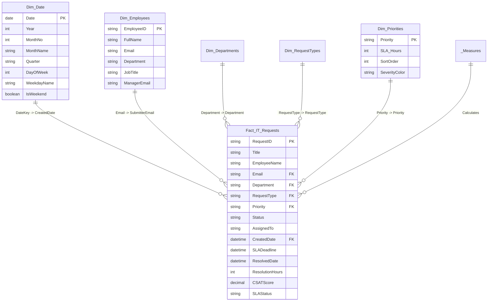

# Power BI Dashboard Specification & DAX Implementation
## Project: IT Service Request & Automation Platform (DKSH Project)

Tài liệu này cung cấp toàn bộ kiến trúc mô hình dữ liệu (Star Schema), bộ mã nguồn **DAX Measures chuẩn doanh nghiệp**, kịch bản biến đổi dữ liệu **Power Query (M-Code)** và bản thiết kế giao diện chi tiết 3 trang báo cáo cho **IT Service Management Dashboard**.

---

## 1. Kiến trúc mô hình dữ liệu (Data Model - Star Schema)

Mô hình dữ liệu được thiết kế theo chuẩn **Star Schema** (Fact - Dimensions) để tối ưu hóa hiệu năng tính toán DAX và khả năng lọc đa chiều:



---

## 2. Power Query M-Code: Tạo bảng `Dim_Date` (Calendar Table)

Trong Power BI Desktop > **Transform Data** > **New Source** > **Blank Query** > Mở **Advanced Editor** và dán đoạn mã M sau:

```powerquery
let
    StartDate = #date(2025, 1, 1),
    EndDate = #date(2026, 12, 31),
    NumberOfDays = Duration.Days(EndDate - StartDate) + 1,
    DateList = List.Dates(StartDate, NumberOfDays, #duration(1, 0, 0, 0)),
    #"Converted to Table" = Table.FromList(DateList, Splitter.SplitByNothing(), {"Date"}, null, ExtraValues.Error),
    #"Changed Type" = Table.TransformColumnTypes(#"Converted to Table",{{"Date", type date}}),
    #"Added Year" = Table.AddColumn(#"Changed Type", "Year", each Date.Year([Date]), Int64.Type),
    #"Added Month" = Table.AddColumn(#"Added Year", "MonthNo", each Date.Month([Date]), Int64.Type),
    #"Added Month Name" = Table.AddColumn(#"Added Month", "MonthName", each Date.ToText([Date], "MMM", "en-US"), type text),
    #"Added Year-Month" = Table.AddColumn(#"Added Month Name", "YearMonth", each Date.ToText([Date], "yyyy-MM"), type text),
    #"Added Quarter" = Table.AddColumn(#"Added Year-Month", "Quarter", each "Q" & Text.From(Date.QuarterOfYear([Date])), type text),
    #"Added Day of Week" = Table.AddColumn(#"Added Quarter", "DayOfWeek", each Date.DayOfWeek([Date], Day.Monday) + 1, Int64.Type),
    #"Added Weekday Name" = Table.AddColumn(#"Added Day of Week", "WeekdayName", each Date.ToText([Date], "dddd", "en-US"), type text),
    #"Added IsWeekend" = Table.AddColumn(#"Added Weekday Name", "IsWeekend", each if [DayOfWeek] >= 6 then true else false, type logical)
in
    #"Added IsWeekend"
```

---

## 3. Thư viện công thức DAX hoàn chỉnh (DAX Measures Library)

Tạo một bảng rỗng tên là `_Measures` trong Power BI để gom toàn bộ các Measure phục vụ báo cáo:

### 3.1. Nhóm chỉ số cơ bản (Core Volume Metrics)

#### 1. Tổng số Ticket (Total Tickets)
```dax
[Total Tickets] = 
COUNTROWS(Fact_IT_Requests)
```

#### 2. Số Ticket đang mở / Đang xử lý (Open Tickets)
```dax
[Open Tickets] = 
CALCULATE(
    [Total Tickets],
    Fact_IT_Requests[Status] IN { "New", "Pending Approval", "Approved", "In Progress" }
)
```

#### 3. Số Ticket đã hoàn thành (Resolved Tickets)
```dax
[Resolved Tickets] = 
CALCULATE(
    [Total Tickets],
    Fact_IT_Requests[Status] IN { "Resolved", "Closed" }
)
```

#### 4. Số Ticket bị từ chối (Rejected Tickets)
```dax
[Rejected Tickets] = 
CALCULATE(
    [Total Tickets],
    Fact_IT_Requests[Status] = "Rejected"
)
```

---

### 3.2. Nhóm chỉ số SLA & Hiệu suất cam kết (SLA Performance Metrics)

#### 5. Số Ticket đạt chuẩn SLA (SLA Met Tickets)
```dax
[SLA Met Tickets] = 
CALCULATE(
    [Total Tickets],
    Fact_IT_Requests[Status] IN { "Resolved", "Closed" },
    Fact_IT_Requests[ResolvedDate] <= Fact_IT_Requests[SLADeadline]
)
```

#### 6. Số Ticket vi phạm SLA (SLA Breached Tickets)
```dax
[SLA Breached Tickets] = 
CALCULATE(
    [Total Tickets],
    OR(
        // Trường hợp 1: Đã resolve nhưng quá hạn
        AND(
            Fact_IT_Requests[Status] IN { "Resolved", "Closed" },
            Fact_IT_Requests[ResolvedDate] > Fact_IT_Requests[SLADeadline]
        ),
        // Trường hợp 2: Chưa resolve nhưng hiện tại đã quá deadline
        AND(
            Fact_IT_Requests[Status] IN { "New", "Pending Approval", "Approved", "In Progress" },
            NOW() > Fact_IT_Requests[SLADeadline]
        )
    )
)
```

#### 7. Tỷ lệ tuân thủ SLA (SLA Compliance Rate %)
```dax
[SLA Compliance Rate %] = 
DIVIDE(
    [SLA Met Tickets],
    [Resolved Tickets],
    0
)
```

#### 8. Tỷ lệ vi phạm SLA (SLA Breach Rate %)
```dax
[SLA Breach Rate %] = 
1 - [SLA Compliance Rate %]
```

---

### 3.3. Nhóm chỉ số thời gian xử lý & Chất lượng (Resolution Time & Quality)

#### 9. Thời gian xử lý trung bình (MTTR - Mean Time to Resolution tính bằng giờ)
```dax
[MTTR (Hours)] = 
AVERAGEX(
    FILTER(
        Fact_IT_Requests,
        Fact_IT_Requests[Status] IN { "Resolved", "Closed" } &&
        NOT(ISBLANK(Fact_IT_Requests[ResolvedDate]))
    ),
    DATEDIFF(Fact_IT_Requests[CreatedDate], Fact_IT_Requests[ResolvedDate], MINUTE) / 60.0
)
```

#### 10. Điểm đánh giá độ hài lòng trung bình (Average CSAT Score - Thang điểm 5)
```dax
[Average CSAT Score] = 
CALCULATE(
    AVERAGE(Fact_IT_Requests[CSATScore]),
    NOT(ISBLANK(Fact_IT_Requests[CSATScore]))
)
```

#### 11. Tỷ lệ khách hàng hài lòng (CSAT Positive % - Đánh giá 4 & 5 sao)
```dax
[CSAT Positive %] = 
DIVIDE(
    CALCULATE([Total Tickets], Fact_IT_Requests[CSATScore] >= 4),
    CALCULATE([Total Tickets], NOT(ISBLANK(Fact_IT_Requests[CSATScore]))),
    0
)
```

---

### 3.4. Nhóm chỉ số phân tích xu hướng (Time Intelligence & MoM Growth)

#### 12. Số lượng Ticket tháng trước (Tickets Last Month)
```dax
[Tickets Last Month] = 
CALCULATE(
    [Total Tickets],
    DATEADD(Dim_Date[Date], -1, MONTH)
)
```

#### 13. Tăng trưởng lượng Ticket so với tháng trước (Ticket MoM Growth %)
```dax
[Ticket MoM Growth %] = 
DIVIDE(
    [Total Tickets] - [Tickets Last Month],
    [Tickets Last Month],
    0
)
```

---

## 4. Thiết kế Layout 3 trang Dashboard (Report Layout)

### Trang 1: Executive KPI Overview (Báo cáo Tổng quan Ban Giám Đốc)
* **Header Bar**: Logo công ty + Tiêu đề *"IT Service Management - Executive Dashboard"* + Slicer bộ lọc: `Date Range`, `Department`, `Priority`.
* **Top KPI Cards (5 Cards ngang)**:
  1. `Total Tickets` (Kèm % tăng trưởng MoM)
  2. `Open Tickets` (Màu cam cảnh báo)
  3. `Resolved Tickets` (Màu xanh lá)
  4. `SLA Compliance %` (Target: > 90%)
  5. `MTTR (Hours)` (Thời gian xử lý trung bình)
* **Hàng giữa (2 Charts lớn)**:
  * **Biểu đồ 1 (Stacked Column & Line Chart)**: `Xu hướng Ticket theo Tháng` (Cột = Resolved/Open, Đường = SLA Compliance %).
  * **Biểu đồ 2 (Donut Chart)**: `Phân bổ Ticket theo RequestType` (Hardware, Software, Network, M365, Account).
* **Hàng dưới (2 Charts)**:
  * **Biểu đồ 3 (Clustered Bar Chart)**: `Số lượng Ticket theo Phòng ban (Department)`.
  * **Biểu đồ 4 (100% Stacked Bar)**: `Tỷ lệ Mức độ ưu tiên (Priority) theo từng Loại yêu cầu`.

---

### Trang 2: SLA & Escalation Analysis (Giám sát Cam kết SLA & Quá hạn)
* **Top KPI Cards**:
  1. `SLA Compliance Rate %`
  2. `SLA Breached Tickets` (Màu đỏ)
  3. `Average Resolution Time by Priority`
* **Visuals**:
  * **Biểu đồ 1 (Matrix Table)**: Ma trận kiểm soát SLA:
    * Rows: `RequestType`, `Priority`
    * Values: `Total Tickets`, `SLA Met`, `SLA Breached`, `SLA Compliance %`, `MTTR (Hours)`.
    * Formatting: Data Bars cho `Compliance %` (Màu đỏ < 85%, Màu xanh >= 90%).
  * **Biểu đồ 2 (Gauge Chart)**: Đo lường mục tiêu SLA Compliance (Min: 0%, Target: 90%, Max: 100%).
  * **Bảng chi tiết (Watchlist Table)**: Danh sách các Ticket đang **Overdue / SLA Breached** cần giải quyết gấp (`RequestID`, `EmployeeName`, `RequestType`, `Priority`, `AssignedTo`, `Overdue Hours`).

---

### Trang 3: IT Team Workload & Agent Performance (Năng suất & Khối lượng Công việc)
* **Top KPI Cards**:
  1. `Active IT Support Engineers`
  2. `Average Tickets per Agent`
  3. `Average CSAT Score` (⭐ X/5.0)
* **Visuals**:
  * **Biểu đồ 1 (Bar Chart)**: `Khối lượng Ticket theo Kỹ sư IT (AssignedTo)` (Chia màu theo Open vs Resolved).
  * **Biểu đồ 2 (Scatter Plot)**: `Tương quan Năng suất`: Trục X = `Số ticket xử lý`, Trục Y = `MTTR trung bình`, Kích thước bóng = `Điểm CSAT`.
  * **Biểu đồ 3 (Column Chart)**: `Phân bố độ tuổi Ticket đang tồn đọng (Ticket Aging Buckets)`:
    * `< 24 Hours`
    * `1 - 3 Days`
    * `3 - 7 Days`
    * `> 7 Days` (Backlog nguy hiểm).

---

## 5. Bảng màu giao diện chuẩn (Color Palette)

| Ý nghĩa | Tên màu | Hex Code | Ứng dụng |
|---|---|---|---|
| **Primary** | Deep Corporate Navy | `#0F2C59` | Header, KPI Cards chính, Nền tiêu đề |
| **Secondary** | Steel Blue | `#337CCF` | Cột Bar Chart, Donut slices |
| **Success** | Forest Green | `#107C41` | Đạt chuẩn SLA, Trạng thái Resolved, 5 sao CSAT |
| **Warning** | Amber Orange | `#D83B01` | Trạng thái In Progress, Ticket sắp quá hạn |
| **Danger** | Crimson Red | `#C41C1C` | Vi phạm SLA, Mức độ Critical, Bị từ chối |
| **Neutral Background** | Cloud Grey | `#F8F9FA` | Nền trang báo cáo |
