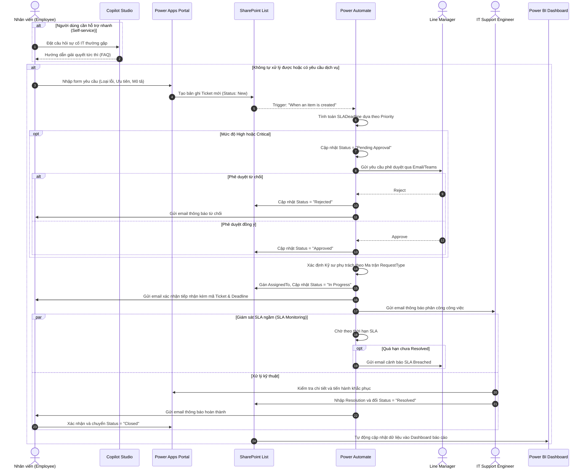

# Process Flow
## Project: IT Service Request & Automation Platform

Tài liệu này mô tả toàn diện luồng nghiệp vụ từ khi nhân viên gặp sự cố, tìm kiếm giải pháp tự phục vụ, gửi yêu cầu, qua các bước phê duyệt và phân luồng tự động, đến khi xử lý hoàn tất và ghi nhận vào hệ thống phân tích.

---

### 1. Luồng tổng thể (End-to-End Business Flow)

---

### 2. Chi tiết các luồng xử lý con (Sub-processes)

#### 2.1. Luồng tính toán SLA (SLA Calculation Rule)
- **Công thức:** `SLADeadline = CreatedDate + SLA_Hours(Priority)`
- **Quy tắc:**
  - `Critical` $\rightarrow$ `addHours(triggerBody()?['Created'], 4)`
  - `High` $\rightarrow$ `addHours(triggerBody()?['Created'], 8)`
  - `Medium` $\rightarrow$ `addHours(triggerBody()?['Created'], 24)`
  - `Low` $\rightarrow$ `addHours(triggerBody()?['Created'], 72)`

#### 2.2. Luồng Phê duyệt (Approval Decision Matrix)
- Nếu `Priority in ('High', 'Critical')` hoặc `RequestType = 'Access Request'`:
  - Trạng thái chuyển sang `Pending Approval`.
  - Gửi thẻ Approval đến `ManagerEmail` với 2 nút **Approve** và **Reject**.
  - Nếu **Reject**: Ghi nhận nhận xét của Quản lý vào `ManagerComments`, gửi thông báo kết thúc cho nhân viên.
  - Nếu **Approve**: Tiếp tục quy trình phân công cho IT Support.

#### 2.3. Luồng Tự động định tuyến (Routing Logic)
Sử dụng khối điều kiện **Switch** trong Power Automate dựa trên giá trị `RequestType`:
- **Case "Hardware"**: Gán cho bộ phận Phần cứng & Thiết bị.
- **Case "Network"**: Gán cho bộ phận Mạng & Hạ tầng.
- **Case "Software" | "Microsoft 365"**: Gán cho bộ phận Ứng dụng & Nền tảng Cloud.
- **Case "Account" | "Access Request"**: Gán cho bộ phận Quản trị Định danh & Phân quyền.
- **Default ("Other")**: Gán cho Trưởng nhóm IT Service Desk để phân loại thủ công.
